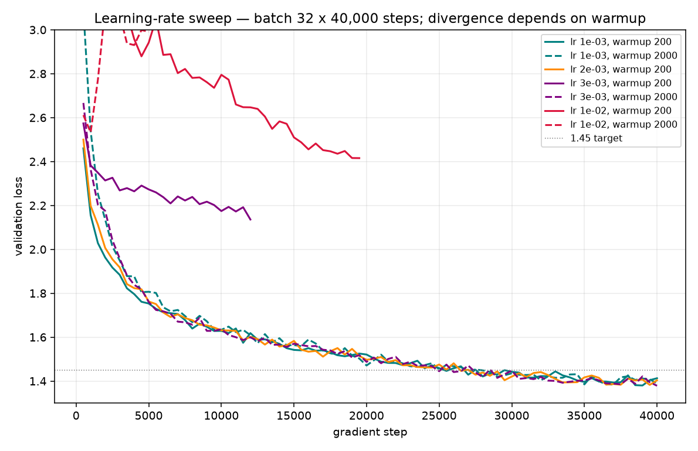
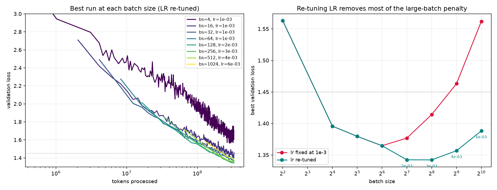
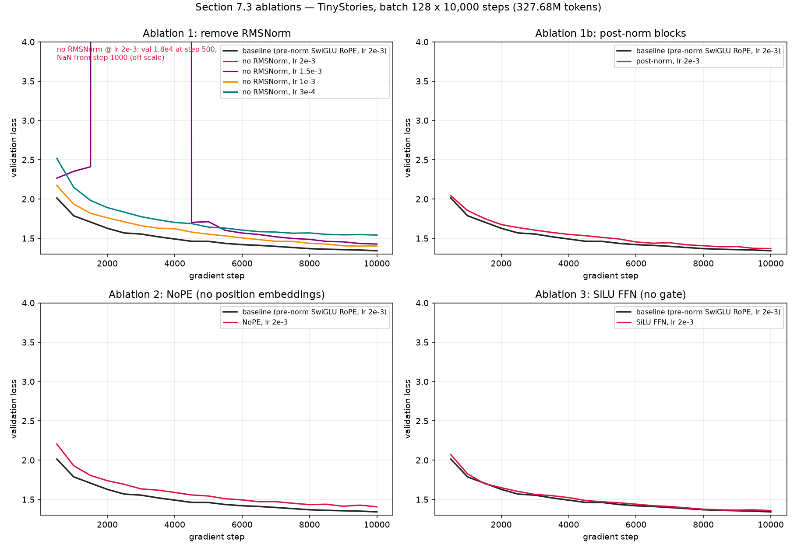
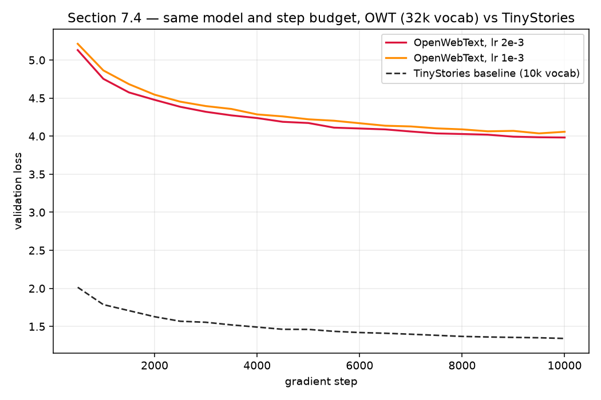

# Assigment 1 Write Up

### train_bpe_expts_owt
- (a) ÃÂ × 16. Makes sense but looks like OWT is a lower quality dataset than tiny stories. 

- (b) The longest tokens in tinystories are [(7160, b' accomplishment'), (9143, b' disappointment'), (9379, b' responsibility'), (3228, b' uncomfortable'), (3515, b' compassionate'), (5319, b' understanding'), (6386, b' neighbourhood'), (6497, b' Unfortunately'), (6874, b' determination'), (7756, b' encouragement')]
```bash
Top tokens in OWT: 
Token ID	Bytes	Decoded content
25822	64	ÃÂ × 16
25836	64	- × 64
31274	48	— × 16
10900	32	- × 32
15947	32	_ × 32
16885	32	ÃÂ × 8
25146	32	= × 32
28585	32	. × 32
31162	32	* × 32
15279	24	— × 8
```

The longest ones in tiny stories are more emotionally coded and the ones in OWT come from artifacts

### tokenizer_experiments
```bash
=== (a) Compression ratios on 10 sampled docs ===
TinyStories tokenizer on TinyStories sample: 4.187 bytes/token
OpenWebText tokenizer on OpenWebText sample: 4.702 bytes/token
  (#bytes ts=7533, #toks=1799; #bytes owt=31604, #toks=6721)

=== (b) Cross-tokenize: OWT sample with TinyStories tokenizer ===
OWT tok on OWT: 4.702 bytes/token (6721 toks)
TS  tok on OWT: 3.198 bytes/token (9882 toks)
Expect worse (higher bytes/token) with TS: less domain match ⇒ shorter merges / more tokens.
Sample decode prefix (TS tok): "What wouldn't you do to save someone you love?\n\nWhen They Come Calling is a modern ghost story, a suspenseful weaving of urban battles,"

=== (c) Throughput estimate ===
Encoded 10,003,969 bytes → 2,430,529 tokens in 0.94s
Throughput: 10,612,098 bytes/s (10.61 MB/s)
Time for The Pile (825GB): 23.2 hours (1.0 days)

=== (d) Serialize train/valid as uint16 ===
uint16 is appropriate because max token id < 65536 for both vocabs (10k / 32k), so 2 bytes/token is enough without wasting space like int32.
Encoding data/TinyStoriesV2-GPT4-train.txt → data/tinystories_train_ids.npy  (32 workers, ~128 chunks)
  split into 128 chunks
  wrote 541,229,347 tokens, max_id=9999 in 84.0s (26.5 MB/s)
Encoding data/TinyStoriesV2-GPT4-valid.txt → data/tinystories_valid_ids.npy  (32 workers, ~128 chunks)
  split into 128 chunks
  wrote 5,465,883 tokens, max_id=9999 in 0.9s (24.3 MB/s)
Encoding data/owt_train.txt → data/owt_train_ids.npy  (32 workers, ~128 chunks)
  split into 128 chunks
  wrote 2,727,120,452 tokens, max_id=31999 in 508.3s (23.5 MB/s)
Encoding data/owt_valid.txt → data/owt_valid_ids.npy  (32 workers, ~128 chunks)
  split into 128 chunks
  wrote 66,401,098 tokens, max_id=31999 in 13.6s (21.3 MB/s)
```

### transformer_accounting

#### (a)

For this bias-free architecture with untied input embeddings and LM head, the parameter count is
$2Vd + L(4d^2 + 3d d_{\mathrm{ff}} + 2d) + d = 1{,}640{,}452{,}800$. In single precision, the parameters
require $6{,}561{,}811{,}200$ bytes, or about $6.562$ GB ($6.111$ GiB).

#### (b)

Let $T=1{,}024$, $d=1{,}600$, $d_{\mathrm{ff}}=4{,}288$, $V=50{,}257$, $L=48$,
$h=25$, and $d_h=d/h=64$. The required matrix multiplies are:

| Matrix multiply | Multiplicity and shape | FLOPs |
|---|---:|---:|
| Query, key, and value projections | $3L$ multiplies of $(T \times d)(d \times d)$ | $6LTd^2 = 754{,}974{,}720{,}000$ |
| Attention scores $QK^\mathsf{T}$ | $Lh$ multiplies of $(T \times d_h)(d_h \times T)$ | $2LT^2d = 161{,}061{,}273{,}600$ |
| Attention-weighted values $AV$ | $Lh$ multiplies of $(T \times T)(T \times d_h)$ | $2LT^2d = 161{,}061{,}273{,}600$ |
| Attention output projection | $L$ multiplies of $(T \times d)(d \times d)$ | $2LTd^2 = 251{,}658{,}240{,}000$ |
| SwiGLU $W_1$ and $W_3$ projections | $2L$ multiplies of $(T \times d)(d \times d_{\mathrm{ff}})$ | $4LTd d_{\mathrm{ff}} = 1{,}348{,}888{,}166{,}400$ |
| SwiGLU $W_2$ projection | $L$ multiplies of $(T \times d_{\mathrm{ff}})(d_{\mathrm{ff}} \times d)$ | $2LTd d_{\mathrm{ff}} = 674{,}444{,}083{,}200$ |
| Final LM head | One multiply of $(T \times d)(d \times V)$ | $2TdV = 164{,}682{,}137{,}600$ |

Thus, the matrix multiplies require
$$
L(8Td^2 + 4T^2d + 6Td d_{\mathrm{ff}}) + 2TdV
= 3{,}516{,}769{,}894{,}400
$$
FLOPs, or about $3.517$ TFLOPs. The embedding lookup, RMSNorm, RoPE, softmax, activations, and residual
operations are not dense matrix multiplies and are excluded from this accounting.

#### (c)

The SwiGLU feed-forward layers dominate at $57.53\%$ of the FLOPs, while multi-head attention as a
whole uses $37.78\%$. Most of that attention cost is in the combined QKV and output projections
($28.62\%$); at this context length, the two quadratic attention products contribute only $9.16\%$.

#### (d)

Using $T=1{,}024$, $V=50{,}257$, and the nearest multiple of 64 to
$\frac{8}{3}d$ for $d_{\mathrm{ff}}$ gives $d_{\mathrm{ff}}=2{,}048$, $2{,}752$, $3{,}392$, and
$4{,}288$ for small, medium, large, and XL, respectively. Each component below is reported as
TFLOPs followed by its proportion of the model's total FLOPs.

| Model | QKV projections | $QK^\mathsf{T}$ | $AV$ | Output projection | SwiGLU FFN | LM head | Total TFLOPs |
|---|---:|---:|---:|---:|---:|---:|---:|
| Small | 0.0435 (14.91%) | 0.0193 (6.63%) | 0.0193 (6.63%) | 0.0145 (4.97%) | 0.1160 (39.76%) | 0.0790 (27.10%) | 0.2916 |
| Medium | 0.1546 (18.62%) | 0.0515 (6.21%) | 0.0515 (6.21%) | 0.0515 (6.21%) | 0.4155 (50.05%) | 0.1054 (12.70%) | 0.8302 |
| Large | 0.3624 (20.49%) | 0.0966 (5.46%) | 0.0966 (5.46%) | 0.1208 (6.83%) | 0.9603 (54.30%) | 0.1317 (7.45%) | 1.7685 |
| XL | 0.7550 (21.47%) | 0.1611 (4.58%) | 0.1611 (4.58%) | 0.2517 (7.16%) | 2.0233 (57.53%) | 0.1647 (4.68%) | 3.5168 |

As model size grows at fixed $T$ and $V$, the FFN share rises from $39.76\%$ to $57.53\%$, and the
combined projection share rises from $19.88\%$ to $28.62\%$, because these block operations scale
roughly as $Ld^2$. The quadratic attention-products share falls from $13.25\%$ to $9.16\%$, while the
LM-head share falls from $27.10\%$ to $4.68\%$.

#### (e)

At $T=16{,}384$, the XL forward pass costs $133{,}577{,}729{,}638{,}400$ FLOPs
($133.578$ TFLOPs), which is $37.983\times$ the cost at $T=1{,}024$. The quadratic attention
products grow from $9.16\%$ to $61.73\%$ of the total, while the combined QKV/output-projection, FFN,
and LM-head shares fall to $12.06\%$, $24.24\%$, and $1.97\%$, respectively.

### learning_rate_tuning
1 slowly dropped loss from 21 to 11. 1e1 dropped it slowly from 20 to 0.01. 1e2 quickly dropped it to a very small number then 0 afterwards. 1e3 diverged and went to inf after a bit. 

### adamw_accounting
GPT-2 XL: ModelConfig(vocab_size=50257, context_length=1024, num_layers=48, d_model=1600, num_heads=25, d_ff=4266.666666666667)

(a) peak memory, at batch_size = 1
        parameters:      6.542 GB  (   6.093 GiB)
         gradients:      6.542 GB  (   6.093 GiB)
   optimizer_state:     13.084 GB  (  12.186 GiB)
       activations:     16.357 GB  (  15.233 GiB)
             total:     42.525 GB  (  39.605 GiB)
  parameters: 1,635,537,600

(b) peak memory as a function of batch size
  16.357 * batch_size + 26.169 GB
  max batch size in 80 GB: 3

(c) FLOPs for one AdamW step
  14 * num_parameters = 2.290e+10 FLOPs
  vs. one forward pass at batch_size 1: 3.507e+12 FLOPs

(d) training 400,000 steps at batch size 1024 on one H100 @ 50% MFU
  1.077e+16 FLOPs/step
  4,836 hours (202 days)

### experiment_log

Logging infrastructure is in [cs336_basics/experiment_log.py](cs336_basics/experiment_log.py); the
experiment log itself is [experiments.md](experiments.md).

### learning_rate

All runs use the §7.2.1 TinyStories config at the full 327,680,000-token budget
(batch 32 × 40,000 steps × context 256), with `lr_min = lr_max/10` so a sweep varies the
schedule's height and not its shape. "clip%" is the fraction of logged steps whose *pre-clip*
gradient norm exceeded `max_grad_norm = 1.0`.

| lr | warmup | best val | clip% | max ‖g‖ | max act RMS | verdict |
|---|---|---|---|---|---|---|
| 1e-3 | 200 | **1.3799** | 0.2% | 1.1 | 12.3 | stable |
| 2e-3 | 200 | 1.3826 | 0.2% | 1.2 | 28.8 | stable |
| 3e-3 | 200 | 2.1360 | 46% | 15.8 | 798 | **diverged** |
| 1e-2 | 200 | 2.4155 | 87% | 402 | 49,489 | **diverged** |
| 1e-3 | 2000 | 1.3846 | 0.5% | 2.3 | 12.8 | stable |
| 3e-3 | 2000 | **1.3787** | 0.2% | 1.1 | 29.4 | stable (best) |
| 1e-2 | 2000 | 2.5328 | 73% | 33.7 | 22,233 | **diverged** |

**(a) Search strategy.** Log-spaced probing outward from a 1e-3 anchor rather than a grid. 1e-3 is
the conventional AdamW starting point at this scale and was run first as a baseline; the second
probe went an order of magnitude up to bracket instability from above, since the cheapest
information early in a sweep is a failure — a diverging run identifies itself in a few hundred
steps. Bisecting inward gave 3e-3, and when 3e-3 diverged at warmup 200 but converged at warmup
2000, warmup was promoted from a fixed setting to a swept axis. Four runs beat the 1.45 target;
best is **1.3787**.



**(b) Edge of stability.** The divergence boundary is a function of *warmup*, not of learning rate
alone — a 10× longer warmup bought roughly 3× more usable learning rate:

| warmup | highest stable | lowest divergent | best lr | best / divergence point |
|---|---|---|---|---|
| 200 | 2e-3 | 3e-3 | 1e-3 | 3× below |
| 2000 | 3e-3 | 1e-2 | 3e-3 | 3.3× below |

`lr=3e-3` is the decisive case: at warmup 200 it plateaus at 2.1360 with 46% clipping; at warmup
2000 it is the best model in the sweep with 0.2% clipping. Identical peak LR, opposite outcomes.

**Folk wisdom is not supported here.** The best LR is not at the edge of stability in either warmup
regime, and more strikingly, *how close you get barely matters*: across the four stable runs the
peak LR varies 3× while final validation loss spans 1.3787–1.3846, a range of 0.006 — comparable to
run-to-run noise. Convergence rate does not separate either; all four stable runs cross 1.45 at
roughly 27,000–29,000 steps. So within the stable band the learning rate is nearly free for final
quality, and its real effect is on *risk*: 3e-3 requires getting warmup right or the run is
destroyed, while 1e-3 tolerates either.

**Divergence never produced a NaN.** Every divergent run kept finite losses and merely plateaued.
Gradient clipping is what prevents the blowup and thereby conceals it — at 87% clipping the step
size is throttled by an arbitrary per-step factor, so the run limps instead of exploding, and
*post*-clip the gradient norm would read ≈1.0 on every step and look healthy. Activation RMS is the
earliest signal, firing ~300 steps before clipping does, and the trigger is arrival at the peak
rather than the ramp: mid-warmup at 5e-3 the run is clean, and one step past the peak the
activation RMS is 53× its healthy baseline.

### batch_size_experiment

Every run holds batch × steps × context = 327,680,000 tokens, so step count varies inversely with
batch size (320,000 steps at batch 4 down to 1,250 at batch 1024). The first pass held `lr` at the
batch-32-tuned 1e-3 throughout; the second re-tuned it per the problem statement, scaling roughly
as √batch from the 1e-3 anchor.

| batch | steps | best lr | best val | val @ lr=1e-3 | clip% | ‖w‖ end |
|---|---|---|---|---|---|---|
| 4 | 320,000 | 1e-3 | 1.5629 | 1.5629 | 98.8% | 767 |
| 16 | 80,000 | 1e-3 | 1.3957 | 1.3957 | 0.2% | 1549 |
| 32 | 40,000 | 1e-3 | 1.3795 | 1.3795 | 0.2% | 1855 |
| 64 | 20,000 | 1e-3 | 1.3646 | 1.3646 | 0.5% | 2038 |
| 128 | 10,000 | 2e-3 | **1.3422** | 1.3767 | 1.0% | 2074 |
| 256 | 5,000 | 3e-3 | **1.3421** | 1.4141 | 2.0% | 2142 |
| 512 | 2,500 | 4e-3 | 1.3567 | 1.4630 | 4.0% | 2187 |
| 1024 | 1,250 | 6e-3 | 1.3881 | 1.5620 | 7.7% | 2220 |
| 2048 | 625 | — | **OOM** | — | — | — |



Batch 2048 is the memory limit —
it fails allocating 19.53 GiB against a B200's 178.35 GiB total.

**Re-tuning the LR is not optional; it changes the conclusion.** At a fixed 1e-3 the results turn
sharply upward past batch 64 and read as "large batches hurt." That is mostly an artifact: the
deficit grows with batch size precisely because 1e-3 is progressively more under-scaled. Once
re-tuned, batch 128 and 256 both reach **1.342**, better than every run in either sweep including
the LR sweep's 1.3787. The √batch rule predicted 2e-3 / 2.8e-3 / 4e-3 / 5.7e-3 and the runs landed
on 2e-3 / 3e-3 / 4e-3 / 6e-3, so it was near-optimal first try at every batch size.

Learning-rate probes at the large-batch end, all at the full token budget:

| batch | 1e-3 | 2e-3 | 3e-3 | 4e-3 | 6e-3 | 1e-2 |
|---|---|---|---|---|---|---|
| 128 | 1.3767 | **1.3422** | — | — | — | — |
| 256 | 1.4141 | — | **1.3421** | — | — | — |
| 512 | 1.4630 | — | 1.3621 | **1.3567** | — | — |
| 1024 | 1.5620 | — | 1.4209 | — | **1.3881** | diverged |

The batch-512 optimum is genuinely flat on top (1.3621 vs 1.3567 across a 33% change in LR),
consistent with the LR sweep's finding that within the stable band the learning rate barely
affects final loss.

**A real penalty does remain at the top end**, and it is a stability ceiling rather than
under-tuning: batch 1024 improves monotonically with LR (1.5620 → 1.4209 → 1.3881 at 1e-3 → 3e-3 →
6e-3) but **diverges at 1e-2**, so its optimum is bracketed and cannot reach 1.342. Past batch 256
you cannot buy back the lost gradient steps with a larger learning rate, because stability caps how
large it can get.

**Small batches fail through two mechanisms beyond gradient noise**, both visible only in the
monitors:

1. *Clipping becomes permanent.* At batch 4, 98.8% of steps are clipped (batch 1: 100%), versus
   0.2% at batch 16. The per-minibatch gradient norm exceeds 1.0 on essentially every step, so
   `max_grad_norm = 1.0` acts as a batch-size-dependent learning-rate reduction that nobody asked
   for. This is a property of the clipping threshold interacting with batch size, not of the
   optimizer.
2. *Weight decay is applied per step, so constant tokens is not constant regularization.* AdamW's
   decoupled decay fires once per step, and at a fixed token budget batch 4 takes 256× more steps
   than batch 1024. Final weight norm rises monotonically with batch size across the whole sweep
   (767 → 2220), i.e. the small-batch runs are far more heavily regularized at nominally identical
   settings.

**Practical answer to "do we always want large batches?" — no, but the limit is higher than the
naive sweep suggests.** Wall-clock saturates early: batch 32 → 64 → 128 takes 13 → 12 → 10 minutes,
so past 128 larger batches buy essentially no speed while costing loss. Batch **128–256 at
2e-3–3e-3** is the sweet spot on both axes.

**Caveats.** (1) No RNG seed, so there is no run-to-run replicate anywhere in this sweep; the
1.3422/1.3421 tie at 128/256 should be read as a tie, not a ranking. (2) Warmup was held at 200
steps in absolute terms, which is 2% of the batch-128 run but 8% of the batch-512 run; batch 1024
used 50. Since the LR sweep showed warmup governs usable LR, part of the batch-1024 ceiling may be
a warmup choice rather than a batch-size effect.

## 7.3 Ablations

All ablations use the best §7.2 config (batch 128 × 10,000 steps × context 256 = 327.68M tokens,
lr 2e-3, warmup 200) against the batch-size sweep's b128/2e-3 baseline, via `--norm {pre,post,none}`,
`--ffn-type {swiglu,silu}`, and `--rope-theta 0` in
[cs336_basics/training_together.py](cs336_basics/training_together.py). ppl = exp(best val loss).



| run | lr | best val | ppl | Δ vs baseline | clip% | max ‖g‖ | params |
|---|---|---|---|---|---|---|---|
| baseline (pre-norm, SwiGLU, RoPE) | 2e-3 | **1.3422** | 3.83 | — | 1.0% | 1.1 | 22.70M |
| no RMSNorm | 2e-3 | **NaN @ step 1000** | — | — | 67% | 7.1e11 | 22.69M |
| no RMSNorm | 1.5e-3 | 1.4277 | 4.17 | +0.086 | 11% | 7.2e7 | 22.69M |
| no RMSNorm | 1e-3 | 1.4010 | 4.06 | +0.059 | 5.0% | 49 | 22.69M |
| no RMSNorm | 3e-4 | 1.5421 | 4.67 | +0.200 | 6.0% | 55 | 22.69M |
| post-norm | 2e-3 | 1.3699 | 3.93 | +0.028 | 1.0% | 1.1 | 22.70M |
| NoPE | 2e-3 | 1.4066 | 4.08 | +0.064 | 1.0% | 1.1 | 22.70M |
| SiLU FFN (d_ff 2048) | 2e-3 | 1.3584 | 3.89 | +0.016 | 1.0% | 1.4 | 22.83M |

### layer_norm_ablation

At the previous optimal LR the model is destroyed: gradient norms run 0.9 → inf between steps
400–900 and the loss is NaN from step 1000 — clipping cannot save it because the *forward*
activations explode. Lower LRs restore stability (best no-norm run: 1e-3 at 1.4010), so RMSNorm
buys ~2× usable learning rate and is still worth +0.06 loss even at the no-norm optimum.

### pre_norm_ablation

Post-norm (eqs. 27–28) trains stably at this depth but sits ~0.03 above pre-norm for the whole
run, finishing 1.3699 vs 1.3422.

### no_pos_emb

NoPE trains stably at 1.4066 (+0.064): the causal mask alone lets the model infer position
implicitly, but RoPE's explicit relative positions still win consistently at context 256.

### swiglu_ablation

At approximately matched parameters (SiLU uses d_ff = 4·d_model = 2048 vs SwiGLU's 1344, +0.6%
params), the gate is worth +0.016 (1.3584 vs 1.3422) — a consistent but small win, the smallest
effect of the three ablations, matching Shazeer's framing of GLU variants as modest reliable gains.

## 7.4 Running on OpenWebText

### main_experiment

Same architecture and step budget as the TinyStories best run, with the 32,000-entry OWT tokenizer
(params 22.7M → 45.2M, all embeddings + LM head); the TinyStories-tuned 2e-3 transferred and beat
a 1e-3 control. ppl = exp(best val loss).



| dataset | vocab | lr | best val loss | perplexity | uniform baseline | bits/byte |
|---|---|---|---|---|---|---|
| TinyStories | 10k | 2e-3 | 1.3422 | **3.83** | ln 10⁴ = 9.21 | 0.46 |
| OpenWebText | 32k | 2e-3 | **3.9822** | **53.6** | ln 3.2·10⁴ = 10.37 | 1.22 |
| OpenWebText | 32k | 1e-3 | 4.0364 | 56.6 | | |

The raw losses are not comparable — different tokenizers over different distributions — but per
byte (each tokenizer's measured compression) TinyStories costs 0.46 bits/byte vs 1.22 for OWT:
web text has a far higher entropy floor, and the OWT curve is still descending at step 10,000
while TinyStories has flattened.

**Generated text** (decoder, temp 0.8, top-p 0.9, 256 tokens):

> On Tuesday, the mayor announced he would be leaving the city.
> The mayor will take action on May 8 and will come with a "large list of the 20 people that are
> transgender," he said.
> The mayor will have a discussion about whether transgender people should be allowed to take part
> in the meeting, he said.
> The city will also have a meeting with the mayor on March 15 at a cost-benefit agreement, he said.
> "It's a city-state solution. But it's also a real issue for the city," he said.
> "It's just not about the city and the city, or the city and the county," he added.
> In a statement, the mayor said the city would be open to the city to discuss the question of
> whether the city should be able to be a "renegotiation" of the city.
> City officials said the city will be open to a long-term, but the city should not allow the
> council to put up a vote. [...]

The text is locally grammatical and has the news register (quote-attribution, datelines, even an
"Advertisements" boilerplate artifact) but no cross-sentence coherence. Quality is worse at
identical model and compute because at 3.98 nats/token every sample draws from a much flatter
distribution than at 1.34, so errors compound — TinyStories is a domain this model can nearly
master within the budget, and OpenWebText is not.